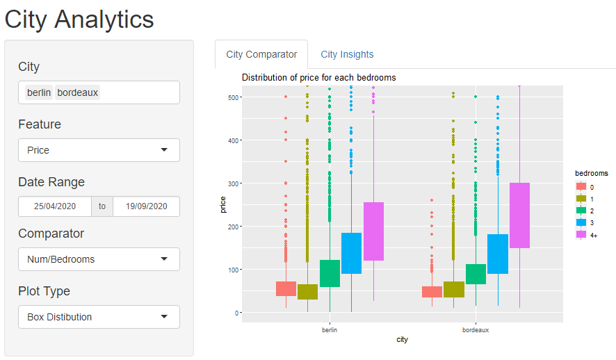
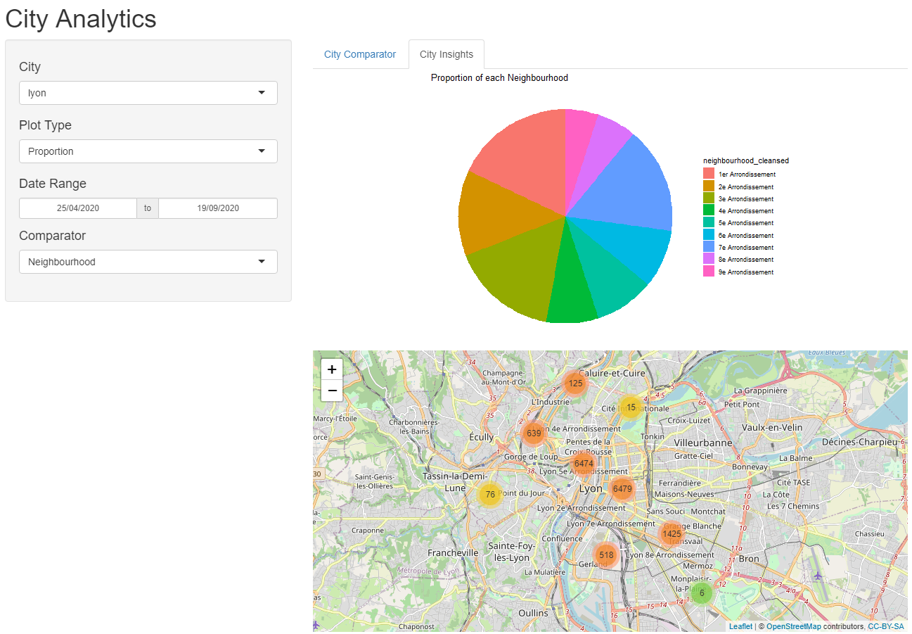

```{r setup, include=FALSE}
knitr::opts_chunk$set(echo = FALSE)
source('Script/Utils.R')
```

## AirBnb Insights

R Shiny app developped to compare and analyze AirBnb listings in big cities

- Provide a Comparator to plot **graphs comparing cities**
- Provide an Insight to plot **advanced metrics** for a specific city
- Provide a **map of the listings** for the given city

## Data & Preprocessing

The data used by the app is taken from insideAirBnb website. 
Application provide a *Utils* script to download and preprocess the data

``` {r url, echo = TRUE}
# Create a Dataframe with available city & dates
create_city_date_dataframe()
```

## Data & Preprocessing

Once the available data is retrieved, this function downloads the adequate csv and create a dataframe with it.
With this cleaned dataset, it is possible to easily retreive information by subseting the dataframe on parameters
```
create_clean_dataset()
```
``` {r cleaned, echo = TRUE}
database <- read.csv("Data/clean_data.csv")
print(colnames(database))
```

## Graphical Interface

- Provides a generic shiny interface 
    - Sidepanel for user input / data filters 
    - Tabbed Navigation panel that contains the output plots
    - Navigation between Comparator & Insight using tabs
- Graphs auto-update on user input change

## Comparator Interface

Comparator tab is made to compare the cities on the same graph. 

User can select data using the Multi Input for cities, as well as the plot type (Box Distribution, Average, Median)

More granularity has been added. User can filter data over this parameters :

- Feature (Price, Availability, Revenue)
- Date Range of data (Between minimal & maximal date of data)
- Comparator (Num/Bedrooms, Room Type, None)

## Comparator Interface

{#id .class width=80% height=80%}


## Insight Interface

Insight tab is made to give deeper analysis of a city. 

In this tab, more plots were added. User can filter data over this parameters :

- Feature (Price, Availability, Revenue)
- Date Range of data (Between minimal & maximal date of data)
- Comparator (Num/Bedrooms, Room Type, None)

In insight view :

- it is the possibility to compare neighbourhood.
- Proportion Pie plot disable features to compare proportion of comparators 
- A map displays the listings by Chunk groups


## Insight Interface

{#id .class width=80% height=80%}

## Try it yourself

Application is available on ShinyApps.Io at the link over there

https://louisdeveze.shinyapps.io/Application/

Thanks for your attention
